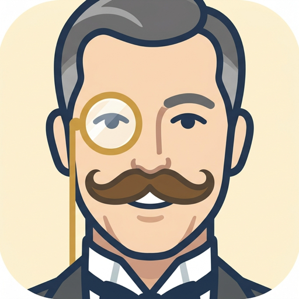

<div align="center">
  
  <h1>Alfred</h1>
  <p><strong>A personal Android voice assistant powered by your n8n workflows.</strong></p>
</div>

Capture tasks and notes, have spoken conversations, and review results from your phone or [Wear OS companion](https://github.com/dev-Blaze/alfred-companion). Requires Android 14+.

Alfred handles capture, clarification, and results. Your n8n workflows handle calendar, tasks, email, and other integrations.

## Modes

| Mode | Use |
|---|---|
| **Task** | Dictate a request, review it, and send. |
| **Note** | Dictate a longer note and stop manually. |
| **Convo** | Speak with your workflow and hear its replies. |

History shows delivery status and responses, with search, export, and retry controls. Requests with uncertain outcomes require review before retrying to avoid duplicate actions.

## Setup

1. Install the phone APK from [Releases](https://github.com/dev-Blaze/alfred/releases). Install the companion release on your watch if needed.
2. Open Alfred's Settings and enter your HTTPS n8n webhook URL and authentication details.
3. Test the connection and grant microphone and notification permissions when prompted.
4. Set Alfred as your digital assistant in Android Settings. On Samsung, assign it under **Advanced features → Side button → Press and hold → Digital assistant app**.

See the [n8n setup and contract guide](docs/N8N_ASSISTANT.md) for workflow configuration.

## Build

```bash
./gradlew :app:assembleDebug
./gradlew :app:assembleRelease
```

Release signing requires `keystore.properties`; see `app/build.gradle.kts`. Phone and watch APKs must use matching signing certificates.

## Notes

- Speech recognition may process audio off-device through the system recognizer.
- Conversation memory depends on your n8n workflow.
- Local history and queued requests are excluded from backup; export history before moving devices.

## License

Personal project. No license is granted for redistribution.
